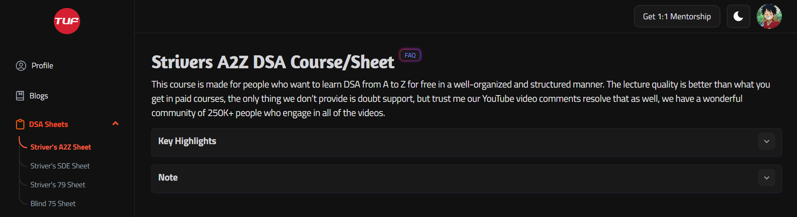

# Striver-A2Z-DSA

Welcome to the Striver-A2Z-DSA repository! This repository is dedicated to my journey of learning Data Structures and Algorithms (DSA) in C++ through the Strivers A2Z DSA course.

## Resources

 **Course Website**: [Strivers A2Z DSA Course](https://takeuforward.org/strivers-a2z-dsa-course/strivers-a2z-dsa-course-sheet-2/)

## About

This repository contains my implementations, solutions, and notes on various DSA topics covered in the Strivers A2Z DSA course. I am sharing this repository to document my learning progress and to provide a resource for others who are also interested in learning DSA.

## Contents

The repository is organized into folders corresponding to different topics covered in the Strivers A2Z DSA course. Each folder contains C++ code implementations, explanations, and any additional notes related to that topic.

<!--
Here's a brief overview of the folders:

- `Arrays`: Implementations and solutions related to array data structure.
- `Linked Lists`: Implementations and solutions related to linked list data structure.
- `Stacks and Queues`: Implementations and solutions related to stack and queue data structures.
- `Trees`: Implementations and solutions related to tree data structure.
- `Graphs`: Implementations and solutions related to graph data structure.
- `Sorting and Searching`: Implementations and solutions related to sorting and searching algorithms.
- `Dynamic Programming`: Implementations and solutions related to dynamic programming problems.
-->

## Contribution

If you find any errors, have suggestions for improvements, or would like to contribute your own solutions, feel free to open an issue or create a pull request. Your contributions are highly appreciated!

## Acknowledgements

Special thanks to Striver for providing the A2Z DSA course.

## Disclaimer

Please note that while the code and explanations provided here are based on my understanding of the concepts covered in the Strivers A2Z DSA course, they may not always be optimal or error-free. Use them as a reference and supplement your learning with other resources as needed.

## Connect

 Connect with me on [LinkedIn](https://www.linkedin.com/in/paras-verma-b38bb1247/).

Happy learning!

